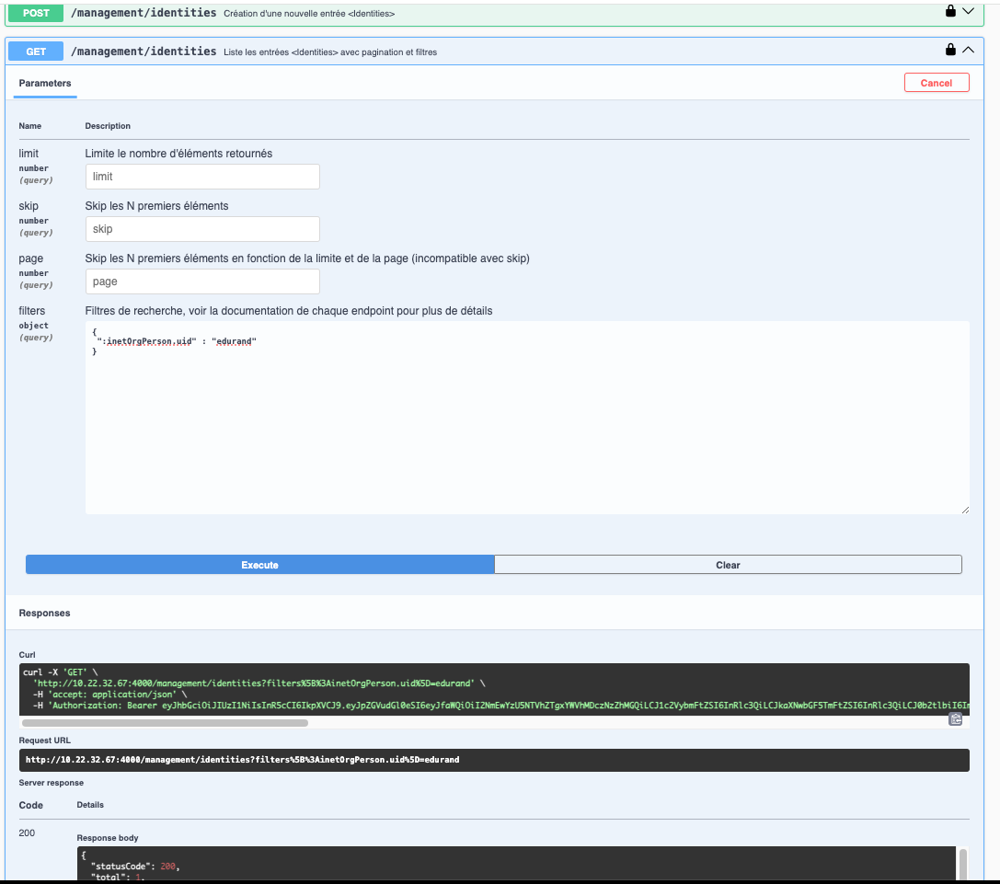
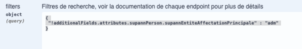

# Les filtres de recherches pour l'API 
L'api a une fonctionnalité de recherche (**GET /management/identities**) qui permet de rechercher les identités

Un filtre peut être passé dans l'url de l'api (methode **GET /management/identities**) pour rechercher les identités selon des critère spécifique

## Syntaxe des filtres à passer en paramètre dans l'url 
La méthode est GET 
### Syntaxe
La syntaxe générale du paramètre est :
* filters[OPERATEUR + CHAMP]=SEARCH
### Les champs
| champ     | Description                  |
|-----------|------------------------------|
| OPERATEUR | l'opérateur (voir en dessous |
| CHAMP     | le champ dans l'identité     |
| SEARCH    | La chaine recherchée         |

### Les opérateurs
| Filter | Description               |
|--------|---------------------------|
| :      | égal                      |
| #      | nombre égal               |
| !#     | Nombre non égal           |
| !:     | Non égal                  |
| \>     | Nombre plus grand         |
| \>\|   | Nombre plus grand ou égal |
| \<     | Nombre plus petit         |
| \<\|   | Nombre plus petit ou égal |
| \^     | Expression régulière      |
| @      | dans la liste             |

### Exemples 
Vous pouvez tester votre filtre et confectionner votre requete à l'aide de swagger qui est disponible sur l'orchestrator à L'url : https://monOrchestrator:4443/swagger
* Rechercher l'uid = "toto"
```
filters[:inetOrgPerson.uid]=edurand
```
Dans l'interface swagger le filtre se saisit en JSON : 
```json
{
 ":inetOrgPerson.uid" : "edurand"
}
```

* Rechercher tous les identités qui ne sont pas "adm"
```
filters[!additionalFields.attributes.supannPerson.supannEntiteAffectationPrincipale]=adm
```
Dans l'interface swagger le filtre se saisit en JSON :
```
{
 "!additionalFields.attributes.supannPerson.supannEntiteAffectationPrincipale" : "adm"
}
```


* Rechercher les identités qui ont le dataStatus à -2 OU -3 (operateur @)

```
filters[@dataStatus][]=-2&filters[@dataStatus][]=-3
```

* Rechercher les identités qui ont dataStatus à -2 ET state à 99
```
filters[:dataStatus]=-2&filters[:state]=99
```
## Champs struturels 
Voici la liste des champs structurels disponibles dans une identité

| Champ                      | Description                                                 |
|----------------------------|-------------------------------------------------------------|
| **state**                  | Etat de l'identité                                          |
|                            | 0 : indeterminé                                             | 
|                            | 1 : à valider                                               |
|                            | 2 : à synchroniser    (envoi aux backends                   |
|                            | 50 : En cours de synchronisation                            |
|                            | 99 : synchronisée                                           |
|                            | -2 : à compléter                                            |
|                            | -99 : ne plus synchroniser (envoi aux backends)             |
| **initState**              | Statut d'envoi du mail de réinitialisation du mot de passe  |
|                            | 0 : le mail n'a jamais été envoyé                           | 
|                            | 1 : Le mail a été envoyé                                    | 
|                            | 2 : le compte a été activé                                  | 
| **dataStatus**             | Etat d'activation de l'identité                             |
|                            | 0 :  Identité non initialisée                               | 
|                            | 1 :  l'dentité est active                                    |
|                            | -1 : l'identité est supprimée et ne doit plus être importée |
|                            | -2 : l'identité doit changer sont mot de passe              |
|                            | -3 : l'identité est désactivée                              |
| **lastSyncBackend**        | Dernier envoi de l'identité aux backends                    |
| **lastSync**               | (TAIGA) date de derniere synchro depuis taiga               |
| **_id**                    | Index unique de l'identité                                  |
| **deletedFlag**            | true ou false Identité supprimée                            |
| **fingerprint**            | Hash de l'identité                                          |
| **metadata.createdBy**     | Utilisateur qui a créé l'identité                           |
| **metadata.createdAt**     | Date de création                                            |
| **metadata.lastUpdatedBy** | Dernier utilisateur qui a modifié l'identité                |
| **metadata.lastUpdatedAt** | Date de la dernière  modification                           |


