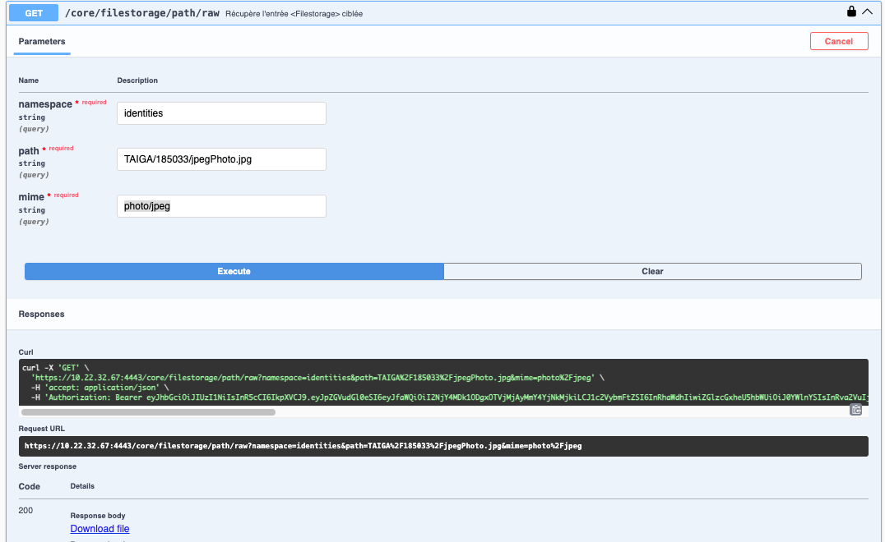

# récupération de la photo d'une identité
Une entrée de l'api est disponible pour pouvoir télécharger la photo d'une identité

Procedure :
* Récupérer le champs **inetOrgPerson.employeeNumber** de l'identité
* Appeler l'api avec ce numéro

Appel : GET /core/filestorage/path
* Parametres : namespace = "identities"
* path : TAIGA/*\<EMPLOYEENUMBER\>*/jpegPhoto.jpg
* mime : photo/jpeg

### Exemple 
Téléchargement de la photo pour l'identité 185033
