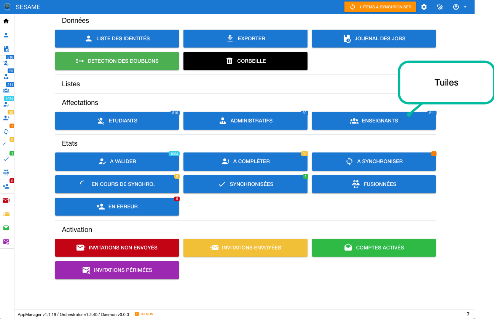
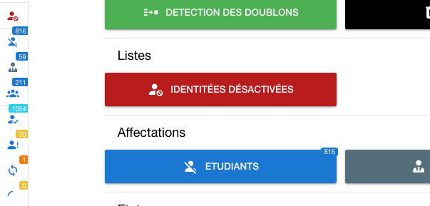

# Personalisation des tuiles de la page d 'accueil'
Des tuiles peuvent être ajoutées sur la page d'accueil et certaines modifiées.



## Fichier de configuration 
Le fichier de configuration est : ./configs/sesame-app-manager/config/menu.yml
```yaml
entries:
  - icon: mdi-account-off
    label: Etudiants
    path: "/identities?sort[metadata.lastUpdatedAt]=desc&skip=0&filters[^additionalFields.attributes.supannPerson.supannTypeEntiteAffectation]=/etd/i"
    color: primary
    part: Affectations
    badgeValue: ETD

  - icon: mdi-account-tie
    label: Administratifs
    path: "/identities?sort[metadata.lastUpdatedAt]=desc&skip=0&filters[^additionalFields.attributes.supannPerson.supannTypeEntiteAffectation]=/adm/i"
    color: primary
    part: Affectations
    badgeValue: ADM

  - icon: mdi-account-group
    label: Enseignants
    path: "/identities?sort[metadata.lastUpdatedAt]=desc&skip=0&filters[^additionalFields.attributes.supannPerson.supannTypeEntiteAffectation]=/esn/i"
    color: primary
    part: Affectations
    badgeValue: ESN

```
### Description d'une entrée
* **icon** : Choix de l'icone (choisir dans https://pictogrammers.com/library/mdi/) (faire précéder le nom par le prefix mdi-)
* **label** : Le texte affiché dans la tuile
* **path** : chemin de l'url à appeler 
* **color** : Nom de la couleur dans la palette du framework Quasar (https://quasar.dev/style/color-palette)
* **part** : dans quelle section mettre la tuile (Données | Listes | Affectations | Etats | Affectations)

### Exemple 
Nous voulons une tuile qui affiche les identités désactivées dans la section Listes

Dans le fichier menu.yml on ajoute une entrée:
```yaml
  - icon: mdi-account-cancel
    label: Identitées désactivées
    path: "/identities?sort[metadata.lastUpdatedAt]=desc&skip=0&filters[:dataStatus]=0"
    color: red-10
    part: Listes
```
Ce qui donnera dans l'interface : 

