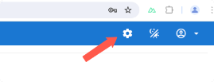
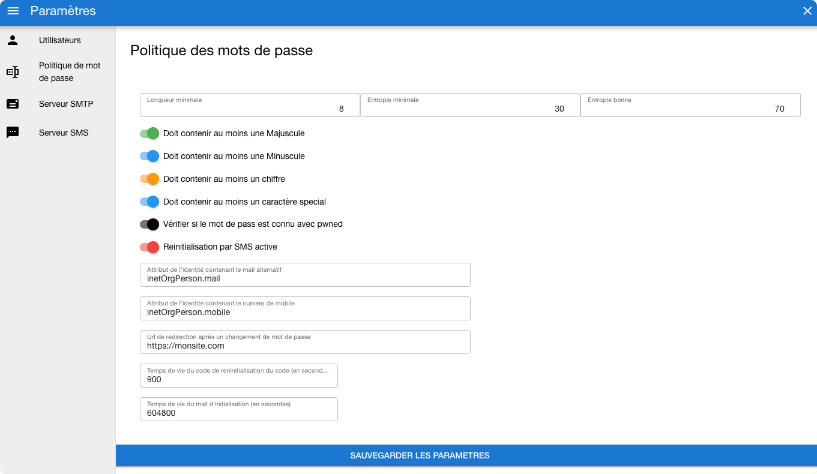
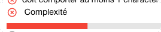
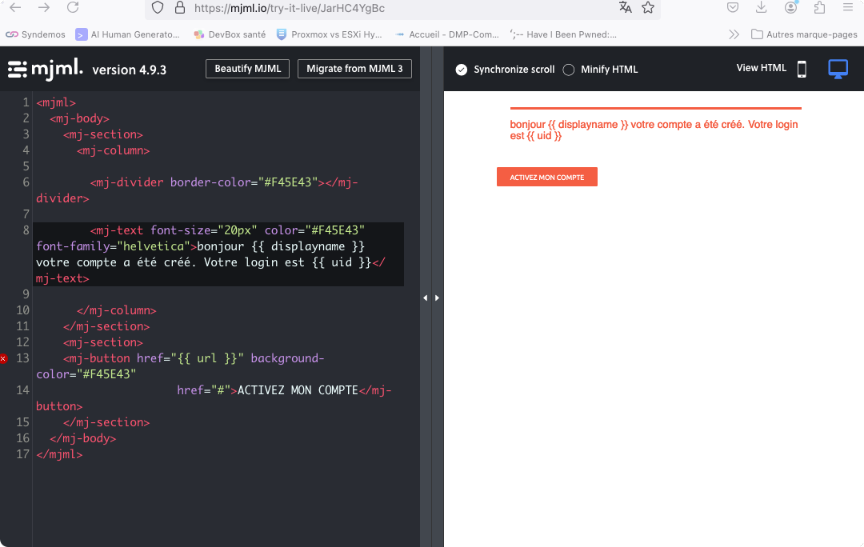

# Configuration de gestion des mots de passe

Toute la configuration de la gestion des mots de passe se fait dans l'interface de Sesame

Pour y acceder depuis l'interface de Sesame : 




## Politique de mot de passe : 

Cliquez sur le menu "Politique de mot de passe " : 



### Les differents paramètres de composition du mot de passe 
* Longueur minimale : Le mot de passe devra au moins avoir cette longueur
* Entropie minimale : Le mot de passe devra au moins avoir ce score voir [Entropie de Shannon](https://fr.wikipedia.org/wiki/Entropie_de_Shannon)
* Entropie considéré comme bonne : A partir de ce nombre nombre l'entropie du mot de passe est considérée comme bonne 

Ces deux limites sont representé dans l'interface de changement de mot de passe par une barre de progression 
* Entropie en dessous sdu minimal :


* Entropie entre le minimal et le seuil bon :


* Entropie au dessus du seuil du bon : 


* Caractères obligatoires : Vous pouvez régler quels caractères obligatoires doit comporter le nouveau mot de passe 
* Vérifier si le mot de passe est connu avec haveibeenpwned (voir [https://haveibeenpwned.com/](https://haveibeenpwned.com/)). Si le mot de passe est connu l'utilisateur ne pourra pas l'utiliser

* Réinitialisez par SMS : L'utilisateur aura le choix de recevoir son code de réinitialisation par mail ou par SMS
### Les paramêtres d'envoi
#### Initialisation du mot de passe 
L'utilisateur recevra un lien pour activer son compte et définir son mot de passe. Cet email est envoyé sur l'adresse mail definie dans l'attribut paramétré
dans **Attribut de l'identité contenant le mail alternatif**

Ex: *additionalFields.attributes.supannPerson.supannAutreMail*

Le lien envoyé est valide pendant une durée de temps determinée présent dans le paramètre **Temps de vie du mail d'initialisation** Ce temps est exprimé en secondes 

### Reset du mot de passe 
Un code à 6 chiffres sera envoyé soit par mail, soit par SMS si celui-ci est activé (pour l'envoi SMS le serveur SMS devra être configuré)

Le temps de validité de ce paramêtre est à definir dans le champs : **Temps de vie du code de reinitialisation** (en secondes aussi)

Si le changement de mot de passe a été fait l'utilisateur sera redirigé vers le site présent dans le paramêtre **Url de redirection après un changement de mot de passe
# Configuration au niveau de sesame-orchestrator 
## Paramêtres pour l'envoi du mail de validation du compte
Dans .env il faut ajouter une variable pour la composition du lien à cliquer : 
```
SESAME_FRONT_MDP="https://monsite.dechanegementdemotdepasse.com"
```
Vous devez redemarrer Sesame-oechstrateur après cette modification

## Modèle des mails 
Vous pouvez genérer votre propre modèle de mail. Voici les étapes à faire pour mettre à jour votre docker-compose.yml. Si l'installation est nouvelle vous pouvez sauter cette étape
* Créer dans configs/orchestrator un repertoire mail-templates
* Modifier docker-compose pour monter ce répertoire : 

Dans le paragraphe volumes de sesame-orchestrator
```yaml
    - ./configs/sesame-orchestrator/mail-templates:/data/templates 
```
* Copier les deux modèles dans le repertoire ./configs/sesame-orchestrator/mail-templates
```shell
cd ./configs/sesame-orchestrator/mail-templates
curl -L 'https://raw.githubusercontent.com/Libertech-FR/sesame-orchestrator/main/templates/initaccount.hbs' --output initaccount.hbs
curl -L "https://raw.githubusercontent.com/Libertech-FR/sesame-orchestrator/main/templates/resetaccount.hbs" --output resetaccount.hbs
```
## Faire son modèle de mail 
Les élements variables liés à l'identité sont entre double crochet '\{ \{ variable \} \}'

* Pour l'initialisation du compte les variables sont : 
    * \{ \{ uid \} \} L'uid de l'identité
    * \{ \{ url \} \} L'url pour l'activation du compte
* Pour la reinitialisation du compte les variables sont : 
    * \{ \{ displayName \} \}
    * \{ \{ uid \} \}
    * \{ \{ code \} \}

### Pour composer son mail de façon graphique 
Vous pouvez vous servir de mjml : [https://mjml.io/](https://mjml.io/). Ce site propose un éditeur en ligne [https://mjml.io/try-it-live](https://mjml.io/try-it-live) et de nombreux modèles 


Une fois le modèle composé sauvez le en html (bouton en haut  "view-html") et copiez le contenu html dans le fichier 
* ./configs/sesame-orchestrator/mail-templates/initaccount.hbs (pour le mail de validation du compte )
* ./configs/sesame-orchestrator/mail-templates/resetaccount.hbs (pour une demande de reinitialisation du mot de passe )

Exemple de fichier mjml : 
```
<mjml>
  <mj-body>
    <mj-section>
      <mj-column>
        <mj-divider border-color="#F45E43"></mj-divider>
        <mj-text font-size="20px" color="#F45E43" font-family="helvetica">bonjour {{ displayname }} votre compte a été créé. Votre login est {{ uid }}</mj-text>
      </mj-column>
    </mj-section>
    <mj-section>
    <mj-button href="{{ url }}" background-color="#F45E43" href="#">ACTIVEZ MON COMPTE</mj-button>
    </mj-section>
  </mj-body>
</mjml>
```
Vous devez relancer les containers 

### Test de l'envoi 
Pour faire les tests de mails sans reel envoi vous pouvez creer un container maildev 

Voici un docker-compose tout pret : 

copiez le dans un repertoire (/data/maildev par exemple) puis lancer **docker compose up -d** 
```yaml 
services:
  maildev:
    restart: always
    image: maildev/maildev
    container_name: maildev.local
    ports:
      - "1080:1080"	
    networks:
      - sesame
networks:
  sesame: 
    external: true      
```

L'url à mettre dans l'interface de sesame dans serveur SMTP est : smtp://maildev.local:1025

Vous pourrez consulter les mails envoyés en vous connectant sur votre serveur *http://monserveur:1080*