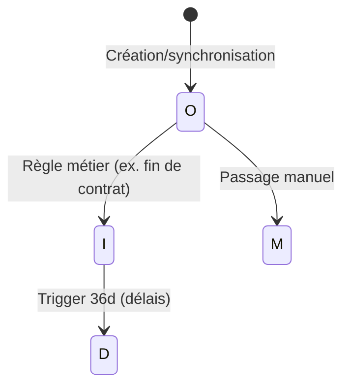

lang: fr-FR
title: Cycle de vie
description: Gestion du cycle de vie des identités
---

# Gestion du cycle de vie

Sésame comprend une gestion de cycle de vie des identités. Elle permet de déclencher automatiquement des changements d’état (lifecycle) selon des règles déclaratives et/ou des délais (triggers).

## Activation 
Par défaut, l’orchestrateur sait gérer le cycle de vie dès lors que le répertoire de configuration est présent dans le conteneur. Montez votre dossier de configuration hôte dans le conteneur.

- Dans docker-compose, section « sesame-orchestrator » → « volumes », ajoutez au choix :
  - pour ne monter que le cycle de vie :
    
    ```
    - ./configs/sesame-orchestrator/lifecycle:/data/configs/lifecycle
    ```

- Redémarrez votre conteneur :

```
docker compose up -d
```

## Configuration 
La configuration se fait à l’aide de fichiers YAML dans le volume monté (./configs/sesame-orchestrator/lifecycle). L’orchestrateur copie automatiquement des fichiers par défaut si le répertoire est vide.

Chemins côté conteneur :

- Fichiers d’états personnalisés : `/data/configs/lifecycle/states.yml`
- Règles de cycle de vie : `/data/configs/lifecycle/rules/*.yml` (tous les fichiers YAML du dossier sont pris en compte par ordre alphabétique)

Remarque : au premier démarrage, si le dossier `/data/configs/lifecycle` est vide, l’orchestrateur y copiera les fichiers présents dans `defaults/lifecycle` (et `defaults/lifecycle/rules`).

### États du cycle de vie

Il existe des états par défaut et des états personnalisables :

- États par défaut (toujours disponibles) :
  - O : Officiel — supannRessourceEtat : {COMPTE} O SupannActif
  - I : Inactif — supannRessourceEtat : {COMPTE} I SupannInactif
  - M : Manuel — supannRessourceEtat : {COMPTE} M SupannManuel

- États personnalisés (optionnels) : vous pouvez en définir dans `states.yml`. Chaque état personnalisé doit :
  - avoir une clé d’une seule lettre qui n’entre pas en conflit avec O, I, M ;
  - avoir un label et une description ;
  - optionnellement une icône (ex. `mdi-account-clock`) et une couleur hexadécimale.

Exemple de `states.yml` pour ajouter « W = En attente » et « D = Supprimé » :

```yml
states:
  - key: 'W'
    label: 'En attente'
    description: 'supannRessourceEtat : {COMPTE} W SupannAttente'
    icon: 'mdi-timer-sand'
    color: '#f0ad4e'
  - key: 'D'
    label: 'Supprimé'
    description: 'Compte marqué comme supprimé (soft delete)'
    icon: 'mdi-delete'
    color: '#d9534f'
```

Astuce : l’API expose les états disponibles (par défaut + personnalisés) : `GET /lifecycle/states` et `GET /lifecycle/states/custom`.

### Structure d'un fichier cycle de vie

Les fichiers de règles doivent être placés dans `/data/configs/lifecycle/rules/` et se terminent par `.yml` ou `.yaml`. Chaque fichier peut contenir un bloc `identities` composé d’une liste de règles.

Champs disponibles pour chaque règle :

- `sources` : liste d’états sources sur lesquels la règle s’applique (ex. `['I', 'W']`).
- `rules` : filtre MongoDB (objet) pour sélectionner les identités concernées.
- `trigger` : délai avant transition. Peut être :
  - un nombre (interprété en jours),
  - une chaîne avec unité : `d` (jours), `m` (minutes), `s` (secondes). Ex. `90d`, `10m`, `45s`.
- `dateKey` : attribut date de référence pour le `trigger` (défaut : `lastSync`). Peut être remplacé, par ex. `initInfo.initDate`.
- `mutation` : objet appliqué en `$set` avant le changement d’état (permet de modifier des champs de l’identité).
- `target` : état cible.

Important :

- Une règle doit définir au moins `rules` ou `trigger`.
- Les règles avec `rules` (sans `trigger`) sont traitées immédiatement lorsqu’une identité passe dans l’état source.
- Les règles avec `trigger` sont traitées de manière périodique par un cron (voir plus bas).

#### Forme 1 : sélection des identités par une règle immédiate
```yml
identities:
  - sources: ['I', 'W']
    rules: {
     'inetOrgPerson.employeeType': 'TAIGA',
    }
    target: D
```
Explication :

- `sources` : la règle se déclenche depuis I (Inactif) ou W (En attente).
- `rules` : filtre MongoDB ; ici seules les identités avec `inetOrgPerson.employeeType = 'TAIGA'` sont ciblées.
- `target` : l’état cible est D (Supprimé). Assurez-vous que D est défini dans `states.yml`.


#### Forme 2 : sélection par trigger (délai)

```yml
identities:
  - sources: ['I']
    rules: {
      'inetOrgPerson.departmentNumber': 'etd',
    }
    trigger: 36d
    target: D

```
Explication :

- `trigger` : défini à `36d` signifie 36 jours. Vous pouvez utiliser un nombre (jours), ou `Xd`, `Ym`, `Zs`.
- `rules` : filtre MongoDB (objet) pour sélectionner les identités concernées (rules peut se cummuler avec le trigger de temps).
- `mutation` : objet appliqué en `$set` avant le changement d’état (permet de modifier des champs de l’identité).
- `dateKey` (optionnel) : par défaut `lastSync`. Vous pouvez le changer, par ex. `dateKey: 'initInfo.initDate'`.
- Traitement : ces règles sont évaluées périodiquement par un cron (voir ci-dessous).

#### Avec une mutation de l’enregistrement
```yml
identities:
  - sources: ['I', 'W']
    rules: {
     'inetOrgPerson.employeeType': 'TAIGA',
    }
    mutation: {
      'inetOrgPerson.cn': 'mutated',
    }
    target: D
```
`mutation` permet d’appliquer un `$set` des champs avant le passage à l’état cible. Ici, `inetOrgPerson.cn` sera modifié avant de passer à D.

### Planification des triggers (cron)

Les règles avec `trigger` sont exécutées par une tâche planifiée. Le cron est configurable par variable d’environnement :

- `SESAME_LIFECYCLE_TRIGGER_CRON` : expression cron (défaut : `*/5 * * * *`, toutes les 5 minutes)

Exemples d’expressions :

- toutes les heures : `0 * * * *`
- chaque nuit à 2h30 : `30 2 * * *`

### Ignorer le cycle de vie pour une identité

Une identité peut être exclue des traitements de cycle de vie en positionnant son champ `ignoreLifecycle` à `true`. Dans ce cas, elle n’est pas prise en compte par les règles, qu’elles soient immédiates ou à délai.

### Bonnes pratiques

- Déclarez d’abord vos états personnalisés dans `states.yml` avant de les utiliser dans les règles (ex. `W`, `D`).
- Utilisez des clés d’un seul caractère et évitez tout conflit avec O/I/M.
- Placez vos règles dans des fichiers séparés et nommez-les de façon à maîtriser l’ordre alphabétique de traitement.
- Testez vos filtres `rules` dans un client MongoDB pour valider la sélection attendue.
- Précisez `dateKey` lorsque le point de référence temporel n’est pas `lastSync`.

### Dépannage

- Au premier démarrage, si le répertoire est vide, des fichiers par défaut sont copiés automatiquement dans `/data/configs/lifecycle`.
- En cas d’erreur de validation YAML, les logs indiquent le fichier et la cause (schéma invalidé). Corrigez la structure (clés manquantes, types incorrects, etc.).
- Vérifiez que les états référencés dans `sources`/`target` existent (défaut ou `states.yml`).

### Exemple de flux (illustration)


