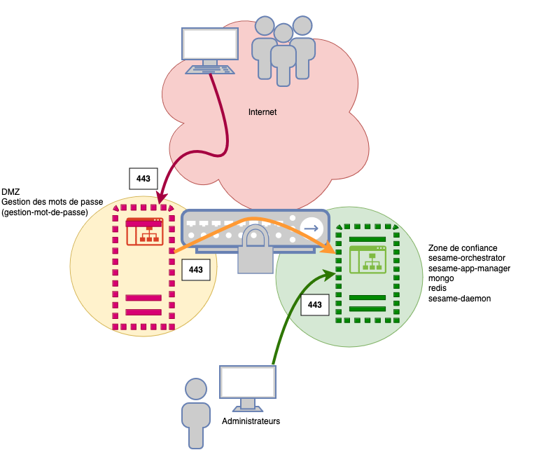

# Architecture de sécurité

L'orchestrator la base mongo, le daemon ne doivent pas être exposés directement sur internet 

## Architecture conseillée


* Le flux de données entre le navigateur et la gestion des mots de passe est publique (port 80, 443). Le serveur doit être situé dans une zone DMZ
* Le flux de donnée entre la gestion des mot de passe et l'orchestrateur doit etre filtrée. Seul le port 443 est necesaire.
* Le flux entre l'administrateur et le frontal de gestion est qu'en interne 

# Sécurisation des flux
Pour sécuriser le flux internet il faut soit installer un reverse proxy sur le serveur , ou paramétrer les services en HTTPS. 
L'installation via reverse proxy est interessante si vous avez plusieurs services sur le host ou si vous voulez ajouter des headers 
de securité ou des restrictions d'url 

La configuration des services en https est plus simple mais moins souple.


## Serveur gestion-mdp 
### Installation (Methode par Reverse-Proxy)
Un script est disponible pour l installation du reverse sur la machine docker hébergant la gestion des mdp
* créez un répertoire ex: "/data/revproxy" et allez dans ce répertoire
* télécharger le script
```
 curl -L 'https://raw.githubusercontent.com/Libertech-FR/sesame-exemple/refs/heads/main/reverse_proxy/gestion-mdp/install.sh' --output install.sh
 
```
* Executez le 
```
#bash install.sh
```
Le script va créer un certificat auto-signé, créer les fichiers de configuration nginx et docker-compose.yml

Pour lancer le container : 
```
#docker compose up -d
```
### Changement des certificats
Vous pouvez mettre des certificats officiels 
* La clé privée : certs/key.pem
* le certificat : certs/cert.pem

## Parametrage du service en HTTPS (Methode alrernative)
## Serveur gestion-mdp
* Modifier docker-compose.yml
```yaml
services:
  sesame-gestion-mdp:
    container_name: sesame-gestion-mdp
    image: ghcr.io/libertech-fr/sesame-gestion-mdp:latest
    restart: always
    env_file: .env
    ports: 
      - 443:3000
    volumes:
      - "./config:/data/src/public"
      - "./certificates:/data/certificates"
```
* Ajouter : - ./certificates:/data/certs"
* Changez le port d'écoute "443:3000"
* Ajouter les variables dans .env
```
SESAME_HTTPS_PATH_KEY=./certificates/server.key
SESAME_HTTPS_PATH_CERT=./certificates/server.crt
SESAME_HTTPS_ENABLED=true
```
### mettez des certificats
Mettez vos certificats dans ./certificates
* La clé privée : ./certificates/server.key
* le certificat : ./certificates/server.crt

## Serveur orchestrator (Méthode par reverse proxy)

Un script est disponible pour l installation du reverse sur la machine docker hébergant l'orchestrator et le frontal de d'administration
* créez un répertoire ex: "/data/revproxy" et allez dans ce répertoire
* télécharger le script
```
curl -L 'https://raw.githubusercontent.com/Libertech-FR/sesame-exemple/refs/heads/main/reverse_proxy/server/install.sh' --output install.sh
```

* Executez le
```
#bash install.sh
```
Le script va créer un certificat auto-signé, créer les fichiers de configuration nginx et docker-compose.yml

Pour lancer le container :
```
#docker compose up -d
```
### Changement des certificats
Vous pouvez mettre des certificats officiels
* La clé privée : certs/key.pem
* le certificat : certs/cert.pem

## Parametrage des service en HTTPS
Les deux services doivent etre parametrés en HTTPS 
* Modifiez docker-compose.yml
```yaml
name: "sesame"

services:
  sesame-app-manager:
    container_name: sesame-app-manager
    image: ghcr.io/libertech-fr/sesame-app-manager:latest
    restart: always
    depends_on:
      - sesame-orchestrator
    environment:
      - SESAME_APP_API_URL=${HOST}:4000
      - SESAME_HTTPS_PATH_KEY=/data/certificates/server.key
      - SESAME_HTTPS_PATH_CERT=/data/certificates/server.crt
      - SESAME_HTTPS_ENABLED=${SESAME_HTTPS_ENABLED:-false}
    volumes:
      - ./configs/sesame-app-manager/statics:/data/src/public/config
      - ./configs/sesame-app-manager/config:/data/config
      - ./certificates:/data/certificates
    ports:
      - "443:3000"
    networks:
      - sesame
      - reverse

  sesame-orchestrator:
    container_name: sesame-orchestrator
    image: ghcr.io/libertech-fr/sesame-orchestrator:latest
    restart: always
    depends_on:
      - sesame-mongo
      - sesame-redis
    environment:
      - SESAME_REDIS_URI=redis://sesame-redis:6379
      - SESAME_MONGO_URI=mongodb://sesame-mongo:27017/sesame
      - SESAME_JWT_SECRET=${JWT_SECRET}
      - SESAME_FRONT_MDP=${SESAME_FRONT_MDP}
      - SESAME_HTTPS_PATH_KEY=/data/certificates/server.key
      - SESAME_HTTPS_PATH_CERT=/data/certificates/server.crt
      - SESAME_HTTPS_ENABLED=${SESAME_HTTPS_ENABLED:-false}

    volumes:
      - ./configs/sesame-orchestrator/jsonforms:/data/configs/identities/jsonforms
      - ./configs/sesame-orchestrator/validations:/data/configs/identities/validations
      - ./configs/sesame-orchestrator/storage:/data/storage
      - ./configs/sesame-orchestrator/mail-templates:/data/templates
      - ./certificates:/data/certificates
    ports:
      - "4000:4000"
      - "4443:4443"
    networks:
      - sesame
      - reverse

  sesame-mongo:
    image: mongo:7.0
    container_name: sesame-mongo
    command: --wiredTigerCacheSizeGB 1.5
    restart: always
    networks:
      - sesame
    volumes:
      - ./db:/data/db

  sesame-redis:
    image: redis
    container_name: sesame-redis
    volumes:
      - sesame-redis:/data
    ports:
      - "127.0.0.1:6379:6379"
    restart: always
    networks:
      - sesame
    command: redis-server --appendonly yes

volumes:
  sesame-redis:

networks:
  sesame:
    external: true
  reverse:
    external: true

```
* Ajouter dans environnement des service app-manager et orchestrator les lignes SESAME_HTTPS_*
```
      - SESAME_HTTPS_PATH_KEY=./certificates/server.key
      - SESAME_HTTPS_PATH_CERT=./certificates/server.crt
      - SESAME_HTTPS_ENABLED=${SESAME_HTTPS_ENABLED}
```
* Ajouter la redirection de port dans ports
```
   - "4443:4443"
```
* Ajoutez dans volumes le montage pour les certificats 
```
    - ./certificates:/data/certificates
```
* Ajout de la variable **SESAME_HTTPS_ENABLED** dans .env
```
SESAME_HTTPS_ENABLED=true
```
### mettez des certificats
Mettez vos certificats dans ./certificates
* La clé privée : ./certificates/server.key
* le certificat : ./certificates/server.crt


N'oubliez pas de changer la variable de l'api dans gestion-mdp pour refleter le protocole et le port de l'orchestrator
```
API_URL=https://monserveruSesame:4443
```

Vous pouvez accéder après redémarrage des containers à l'api en https sur le port 4443 : https://monsesame:4443/swagger