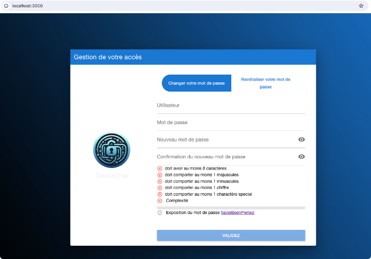

# Instalation du frontal de gestion de mot de passe 
## Introduction 
Le frontal de gestion du mot de passe va permettre à l'utilisateur de : 
* Changer son mot de passe 
* demander une reinitialisation du mot de passe 
* de valider son compte lors de la premiere connexion 

## Principe 
Le frontal communique avec sesame-orchestrator. Il lui envoie la commande de changement ou de reinitialisation du mot de passe.
Si tout est ok l'orchestrateur envoie l'ordre aux differents backends de changer le mot de passe


## Installation 

Docker doit être installé (voir l'installation de [docker](/installation/installation-server.html#prerequis) )

Excecutez le shell d installation en copiant cette ligne ci-dessous
```bash
curl -s https://raw.githubusercontent.com/Libertech-FR/sesame-exemple/main/gestion-mdp/install.sh>./install.sh;bash ./install.sh
```
Repondez aux questions

L'installation a généré un fichier .env et un fichier docker-compose.yml
```bash
# Variables obligatoires
API_URL=http://monserveruSesame:4000
API_KEY=MACLE_API
# Variables facultatives
COLOR_PRIMARY='#1976d2',
COLOR_SECONDARY='#26A69A',
COLOR_ACCENT='#9C27B0',
COLOR_DARK='#1d1d1d',
COLOR_DARK_PAGE='#121212',
COLOR_POSITIVE='#21BA45',
COLOR_NEGATIVE='#C10015',
COLOR_INFO='#31CCEC',
COLOR_WARNING='#F2C037'
```
Exemple du fichier docker-config.yml 
```yaml
services:
  sesame-gestion-mdp:
    container_name: sesame-gestion-mdp
    image: ghcr.io/libertech-fr/sesame-gestion-mdp:latest
    restart: always
    ports: 
      - 3002:3000
    volumes:
      - "./config:/data/src/public"
    networks:
      - sesame 

networks:
  sesame:
    external: true


```

**ATTENTION : Ce fichier docker-compose est donné à des fins de test. Il devra être adapté à votre architecture réseau pour la mise en production**

### Paramètres du fichier .env

## Personalisation de l'interface 
### Images et logo
L'installation a créé un repertoire config :
```
config/faveicon.ico  <--- Icone de l'onglet 
config/img/logo.png  <--- Le logo se trouvant sur la page 
config/img/background.png <--- Le fond d'ecran
```
Ces images (logo et background) doivent être au format PNG

### couleurs
Des variables d'environnement à mettre dans .env permettent de changer les couleurs de bases
```
COLOR_PRIMARY='#1976d2',
COLOR_SECONDARY='#26A69A',
COLOR_ACCENT='#9C27B0',
COLOR_DARK='#1d1d1d',
COLOR_DARK_PAGE='#121212',
COLOR_POSITIVE='#21BA45',
COLOR_NEGATIVE='#C10015',
COLOR_INFO='#31CCEC',
COLOR_WARNING='#F2C037'
```
Se referer au site de site de quasar.dev pour les explications : [Quasar Theme Builder](https://quasar.dev/style/theme-builder)

## Configuration de la politique de mot de passe 

Voir le chapitre [Confifuration de la politique de mot de passe](/sesame-doc/configuration/config-gestion-mdp.html)